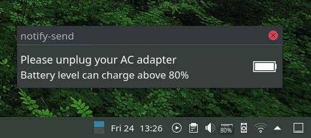
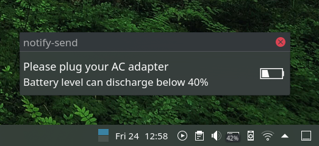

# battery-notify-linux

This script notifies when battery is above 80% while charging and when battery is below 40% while running on battery (you can customize the charge percentage in script).

## Screenshots



## Setup Instructions

[*] Install git (if already installed, ignore)

```sudo apt install git```

[1] Install battery information viewer

```sudo apt install acpi sox libsox-fmt-all libnotify-bin```

[2] Clone this project in your home folder

```git clone https://github.com/s01k/battery-notify-linux```

[*] Test the audio and notification by

```notify-send -u critical "Please unplug your AC adapter" "Battery level can charge above 80%" -i battery-full-charged && play ~/battery-notify-linux/loud_alarm.mp3```

[*] To add custom music, copy any music file in "battery-full-notify-linux" folder, and change the music file name in
```play ~/battery-notify-linux/your file name.mp3```

[3] Make the "batteryfull.sh" file (inside battery-notify-linux folder) executable and execute it by double click (or) in terminal.

[*] Add the script in your startup (different DEs have different method, please check online for "add script/application in startup for linux mint") for automatically starting the script whenever your OS starts.

## Footnotes

[battery-full-notification-KDE5 by jruedaq](https://github.com/jruedaq/battery-full-notification-KDE5)

[battery-full-notification by theArjun](https://github.com/theArjun/battery-full-notification)

[ACPI](https://tldp.org/HOWTO/html_single/ACPI-HOWTO/)

[SOX](https://linux.die.net/man/1/sox)

